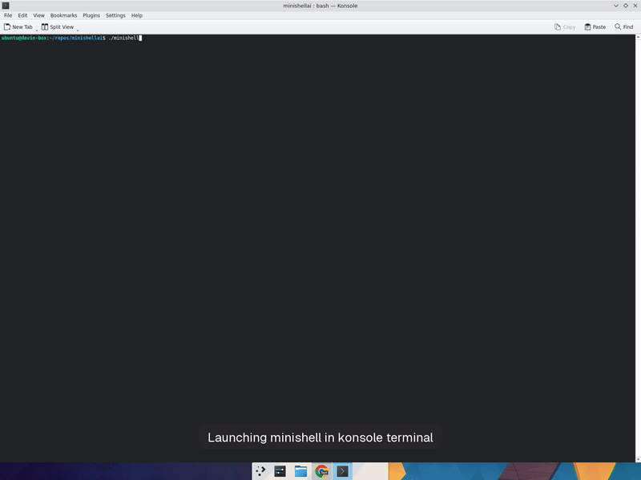

# minishellai

> A complete minishell implementation built entirely by an AI (Devin by Cognition) from a single prompt and a PDF specification.

---

## DISCLAIMER

**This project exists purely as a demonstration of AI capabilities. It should NOT be used as a submission for 42 School projects.**

The entire point of 42's curriculum is to learn by doing. Using AI to build your projects defeats the purpose of your education. The struggle of debugging segfaults at 3am, the satisfaction of finally understanding how `fork()` and `execve()` work together, the deep knowledge you gain from parsing strings character by character -- these experiences are what make you a real engineer. No AI-generated code can replace that.

If you're a 42 student reading this: **close this repo and go write your own minishell.** You'll thank yourself later.

---

## Demo



*Interactive testing session showing echo, cd/pwd, environment variables, pipes, redirections, quotes, signals, history navigation, and clean exit.*

---

## What Is This?

This is a fully functional shell written in C that replicates core bash behavior. It was built by [Devin](https://devin.ai), an AI software engineer, using nothing more than:

1. A single user message: *"Build the application detailed on the pdf attached, following all of the constraints and reproducing all of the expected behaviours and outputs."*
2. The [42 minishell subject PDF](https://projects.intra.42.fr/projects/minishell) attached to that message.

No follow-up instructions were given for the implementation itself. The AI read the PDF, planned the architecture, wrote every line of code, debugged compilation errors, created a pull request, fixed bugs from automated review, and tested everything interactively -- all autonomously.

---

## How It Was Built: The Process

### The Prompt
The user sent one message with the PDF attached. That's it. No architecture guidance, no code snippets, no "start with the lexer" hints.

### The AI's Approach

**1. Reading and understanding the spec (~2 min)**
- Extracted all requirements from the PDF
- Identified constraints: `-Wall -Wextra -Werror`, max 1 global variable, no memory leaks, specific allowed functions only
- Listed all mandatory features: 7 builtins, pipes, semicolons, redirections, environment variables, quotes, signals

**2. Architecture planning**
- Designed a modular architecture splitting the shell into independent concerns:
  - **Libft** -- utility library (42 tradition)
  - **Environment** -- linked list of key-value pairs
  - **Lexer** -- tokenizes raw input into typed tokens
  - **Parser** -- builds command group structures from tokens
  - **Expander** -- processes `$VAR`, `$?`, and quote removal
  - **Executor** -- forks processes, sets up pipes and redirections
  - **Builtins** -- the 7 required built-in commands
  - **Signals** -- ctrl-C, ctrl-D, ctrl-\ handling
  - **Termcap** -- raw-mode line editing with history

**3. Implementation (~15 min)**
- Wrote 46 files, ~3000 lines of C code
- Built the libft first, then worked bottom-up: env -> lexer -> parser -> expander -> executor -> builtins -> signals -> termcap

**4. Debugging and fixing (~5 min)**
- Hit a compilation error: `newline` conflicted with a termcap macro -- renamed the variable
- Missing `#include <string.h>` for `strerror` -- added it
- Missing struct member for history navigation -- added `hist_cur` to the shell struct

**5. Automated review found 3 bugs**
- **Parser double-call**: `parse_pipeline()` was called twice per loop iteration -- first call leaked memory, second overwrote the result. Fixed by removing the redundant call.
- **Dangling pointers in termcap**: `tgetstr()` wrote pointers into a stack-allocated buffer that went out of scope. Fixed by making the buffer `static`.
- **Dead code**: `tc_clear_line()` and `tc_putchar()` were defined but never called. Removed them.

**6. Testing**
- Smoke-tested via piped input first
- Then ran full interactive testing in a terminal, covering all 14 test cases
- Recorded the session as proof (the GIF above is from this recording)

---

## What Worked

- **Modular architecture** -- splitting into lexer/parser/expander/executor made the code manageable and each piece independently testable
- **Bottom-up implementation** -- building utilities first, then data structures, then logic meant each layer could rely on tested foundations
- **Strict compilation flags from the start** -- compiling with `-Wall -Wextra -Werror` from the first `make` caught issues early rather than at the end
- **The 42 libft pattern** -- having a utility library ready before writing the main code prevented reinventing string functions everywhere

## What Didn't Work (or Needed Fixing)

- **The parser had a copy-paste bug** -- `parse_pipeline()` was called twice in a loop, a classic "I wrote the line, then forgot to delete the draft version" mistake. This would have caused memory leaks and potentially wrong behavior with semicolons.
- **Stack vs static lifetime confusion** -- `tgetstr()` returns pointers into a buffer you provide, but the buffer was stack-allocated in a function that returned. Classic C footgun that the AI fell into.
- **Signal handling in raw mode** -- initially wrote code checking `g_signal == SIGINT` after `read()`, but since `ISIG` was disabled for raw mode, SIGINT never arrives as a signal. The ctrl-C was actually already handled correctly as character value 3, making the signal check dead code.
- **Naming collision with system macros** -- used `newline` as a variable name, which collided with a termcap macro. A subtle issue that only manifests when including certain headers.

---

## Tips for Creating with AI (Especially for 42 Students)

> **Remember: These tips are for learning about AI as a tool, NOT for submitting AI-generated work as your own.**

### 1. Be specific in your prompts
The more context you give, the better. Attaching the actual PDF spec worked much better than describing the project in words would have.

### 2. Constraints are your friend
Telling the AI about `-Wall -Wextra -Werror`, the global variable limit, and allowed functions forced it to write cleaner code. Without these constraints, it likely would have taken shortcuts.

### 3. AI is great at boilerplate, weak at subtlety
The lexer, parser structure, and Makefile were solid on the first try. The subtle bugs (dangling pointers, signal handling in raw mode) are exactly the kind of thing AI tends to get wrong. These are also exactly the things you learn the most from debugging yourself.

### 4. Automated review catches what AI misses
The PR auto-review caught the parser double-call and the dangling pointer bug. Always review AI-generated code -- it compiles and runs but may have latent bugs.

### 5. AI doesn't truly understand memory
The dangling pointer bug is a perfect example. The AI knows the pattern of using `tgetstr()` but didn't reason about the lifetime of the buffer. Understanding memory management is a skill you build by struggling with it, not by reading AI-generated code.

### 6. Test interactively, not just with scripts
Piped input (`echo "cmd" | ./minishell`) misses interactive features like signals, history, and line editing. The AI had to test in an actual terminal to catch these behaviors.

### 7. The learning is in the struggle
If this AI can build minishell in ~20 minutes, what's the point of spending weeks on it? **The point is that you become the person who understands every line.** The AI generated 3000 lines of C but doesn't actually understand what `fork()` does or why `SIGINT` behaves differently in raw mode. After building minishell yourself, you will.

---

## Features

- **Interactive prompt** with `minishell$` prefix
- **Line editing** with cursor movement, backspace, and character insertion (termcap)
- **Command history** with up/down arrow navigation
- **7 builtins**: `echo` (with `-n`), `cd`, `pwd`, `export`, `unset`, `env`, `exit`
- **Pipes**: `ls | grep foo | wc -l`
- **Semicolons**: `echo a ; echo b`
- **Redirections**: `>` (output), `>>` (append), `<` (input)
- **Environment variables**: `$VAR` expansion, `$?` for last exit status
- **Quote handling**: single quotes (literal), double quotes (with `$` expansion)
- **Signal handling**: ctrl-C (new prompt), ctrl-D (exit), ctrl-\ (ignored)
- **PATH resolution**: searches directories in `$PATH` for executables
- **Error handling**: "command not found" messages, proper exit codes

---

## How to Compile and Run

### Prerequisites

- A C compiler (`cc` / `gcc`)
- `libncurses-dev` (for termcap support)
- A Unix-like system (Linux / macOS)

```bash
# Install ncurses development library (Debian/Ubuntu)
sudo apt-get install -y libncurses-dev

# On macOS (usually pre-installed, otherwise):
# brew install ncurses
```

### Building

```bash
# Clone the repository
git clone https://github.com/jlbernardo/minishellai.git
cd minishellai

# Build the project
make

# The binary is created at ./minishell
```

### Makefile Rules

| Command | Description |
|---------|-------------|
| `make` | Build libft and minishell |
| `make clean` | Remove object files |
| `make fclean` | Remove object files and binary |
| `make re` | Full rebuild (fclean + all) |

### Running

```bash
./minishell
```

You'll see the `minishell$` prompt. Type commands as you would in bash:

```
minishell$ echo hello world
hello world
minishell$ ls | grep Makefile
Makefile
minishell$ export NAME=42
minishell$ echo "Hello $NAME"
Hello 42
minishell$ exit
```

### Compilation Flags

The project compiles with strict flags:
```
cc -Wall -Wextra -Werror
```
Zero warnings, zero errors.

---

## Project Structure

```
minishellai/
├── Makefile
├── includes/
│   └── minishell.h          # All structs, prototypes, and defines
├── libft/                    # Utility library (42 tradition)
│   ├── Makefile
│   ├── ft_strlen.c, ft_strdup.c, ft_strjoin.c, ...
│   └── libft.h
├── src/
│   ├── main.c               # Entry point and main loop
│   ├── env/                  # Environment variable management
│   ├── lexer/                # Tokenizer (input -> tokens)
│   ├── parser/               # Parser (tokens -> command structures)
│   ├── expander/             # Variable expansion and quote removal
│   ├── executor/             # Process execution, pipes, redirections
│   ├── builtins/             # echo, cd, pwd, export, unset, env, exit
│   ├── signals/              # Signal handlers
│   └── termcap/              # Line editing and history
└── assets/
    └── demo.gif              # Demo recording
```

---

## Known Limitations

- **Bonus features not implemented**: heredoc (`<<`), logical operators (`&&`, `||`), wildcard expansion (`*`)
- **Unclosed quotes**: silently accepted rather than producing a syntax error
- **42 Norm**: some functions exceed the 25-line limit (Norminette would flag them)
- **Memory on allocation failure**: some intermediate allocations in string joining chains aren't checked for NULL

---

## The Human's Role

The human ([@jlbernardo](https://github.com/jlbernardo)) provided:
1. The initial prompt with the PDF
2. Approval to test the application
3. The request for this README

Everything else -- architecture, implementation, debugging, testing, documentation -- was done by the AI.

This is both impressive and a cautionary tale. The AI built a working shell, but a 42 student who builds their own will understand systems programming at a level this AI never will.

---

## License

This project is a demonstration. Use it to learn about AI capabilities, not to submit as your own work.

---

*Built by [Devin](https://devin.ai) | Prompted by a human with a PDF and a dream*
